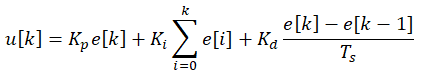
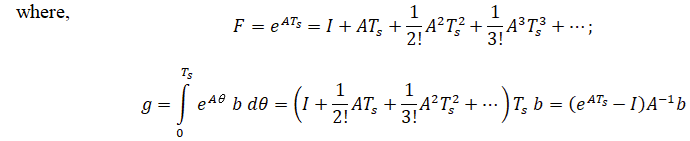

## Introduction

<b>Discipline | <b>Electrical Engineering 
:--|:--|
<b> Lab | <b> Digital Control Laboratory
<b> Experiment|     <b> Design of a discrete PID controller for a DC motor and Exp 10

### About the Experiment 

Designing a discrete PID controller for a DC motor involves adapting the traditional continuous PID control strategy to a discrete-time system, where the control signal is updated at regular intervals. 
In real-world applications, especially with digital computers or microcontrollers, the control system operates in discrete time rather than continuous time. 
A discrete PID controller calculates the control signal at each sampling step based on the error between the desired and actual motor outputs (e.g., speed or position).
The discrete PID controller consists of three terms: Proportional (P), Integral (I), and Derivative (D). Each term is computed using the error signal and its past values, with the discrete-time version typically expressed as:
 

 
$$                   \tag{1} $$

 
where, e[k] is the error, Ts is the sampling time, 
Kp, 
Ki, and Kd are are the controller gains. The design process involves selecting appropriate sampling rates, tuning the PID gains, and ensuring system stability and performance over discrete time steps.
The discrete PID controller is essential for digital systems controlling DC motors, offering precise control over motor speed, position, and torque in real-time applications.  

<b><i>Designing a discrete PID controller using State Space Model:</i></b>  

Linear time invariant system may be represented in state space form by the following equations: 
State equation:
$$ \dot{x}(t)=A x(t)+B u(t) \tag{2a} $$
Output equation:
$$ y(t)= C x(t) u(t) \tag{2b} $$

Discrete state space form represented by the following equations: 
State equation:
$$ {x}[k+1]=F x[k]+g u[k] \tag{3a} $$
Output equation:
$$ y[k])= C x[k] u[k] \tag{3b} $$

 

<b><i>Adding Integral State for PID Control:</i></b>  
The integral state is defined as: 

$$ x_3 [k+1]=x_3 [k]+T_s(r[k]-x_1 [k]) \tag{4} $$
where, r[k] is the reference input (desired position), x1[k] is the position θ[k].
  

<b>Subject matter expertise | <b> **Prof. Alok Kanti Deb**
:--|:--|
<b> Institute | <b>  **Indian Institute of Technology Kharagpur**
<b> Email id|     <b>  **alokkanti@ee.iitkgp.ac.in**
<b> Department |  **Department of Electrical Engineering**
<b>Webpage| <b> http://www.iitkgp.ac.in/department/EE/faculty/ee-alokkanti

### Contributors List

SrNo | Name | VLabs Developer or Integration Engineer | Designation | Department| Institute
:--|:--|:--|:--|:--|:--|
1 | **Kamal Sandeep Karreddula** | Developer | Research Scholar | Department of Electrical Engineering | IIT Kharagpur | 
2 | **Piyali Chattopadhyay** | Integration Engineer | Project Scientist | Department of Mechanical Engineering | IIT Kharagpur |

