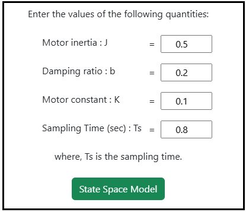
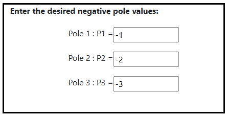
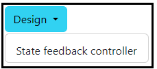

### Procedure

<b>Steps to perform the simulation</b>

										
1. Enter the parameter values of the DC motor.

<b>Fig. 1. Parameter values of the DC motor</b>						  

2. Click on 'State Space Model' button to get the state space form of the system.

<b>Fig. 2. Button to get the state Space form of the system</b>							  

        
3. Click on ' Adding Integral State for PID control' button to get the augmented discrete state space model. 

<b>Fig. 3. Button to add Integral State for PID control  </b>						  

4. Click on ' Enter the desired pole location' button to enter the desired pole values. 

<b>Fig. 4. Button to enter the desired pole values  </b>						  

5. Enter the desired pole values. 

<b>Fig. 5. The desired pole values </b>						  

6. Click on 'Design' dropdown button and select the desired option for the design. 

<b>Fig. 6. Dropdown button for selecting the required design option </b>						  

7. Click on the 'Run' button to run the selected design.

<b>Fig. 7. Run button to calculate the selected design </b>						  

8. Click on the 'Rank' or 'Determinant'  or 'inference' or ' Gain Values' buttons to get the the Controllability test information and gain values. 

<b>Fig. 8. Buttons to get Rank, determinant, inference and gain values information </b>						  

9. Click on 'Clear' button to enter the new parameter values of the system. 

