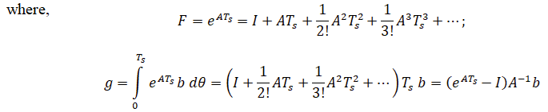

# Theory

         
<figcaption style="color:black"> Fig.1. DC Motor Model </figcaption>						  

 			        
<b><i>The DC motor dynamics:</i></b>  
The DC motor dynamics are represted by the following equation:  
<b><i>Mechanical equation:</i></b>  

$$ J\ddot{\theta}(t)+b{\dot\theta}(t)=K u(t)  \tag{1}$$

where,
J is the motor inertia, b is the damping coefficient, K is the motor constant, θ(t) is the angular position of the motor, u(t) is the input voltage (control input). 
  

<b><i>Electrical equation:</i></b>  

$$ L \dot{i}(t)+R {i}(t)=u(t)  \tag{2}$$

where,
L is the inductance, R is the resistance, i(t) is the motor current. 
  

<b><i>Transfer Function:</i></b>  

$$ G(s) = \frac{θ(s)}{u(s)} = \frac{K}{J s^2 + b s}   \tag{3}$$

Linear time invariant system may be represented in state space form by the following equations: 
State equation:

$$ \dot{x}(t)=A x(t)+B u(t) \tag{4a} $$

Output equation:

$$ y(t)= C x(t) \tag{4b} $$

Discrete state space form represented by the following equations: 
State equation:

$$ {x}[k+1]=F x[k]+g u[k] \tag{5a} $$

Output equation:

$$ y[k]= C x[k] \tag{5b} $$

 

<b><i>Adding Integral State for PID Control:</i></b>  
The integral state is defined as: 

$$ x_3 [k+1]=x_3 [k]+Ts(r[k]-x_1 [k]) \tag{6} $$

where, r[k] is the reference input, x1[k] is the position θ[k].
  
<b><i>State Space Model of the DC motor:</i></b>  
  Continuous State Space form:  

$$	\begin{bmatrix} 	\dot{x}_1(t)  \newline	\dot{x}_2(t) \end{bmatrix}	= \begin{bmatrix} 	0  & 1 \newline	0 & -\frac{b}{J} \end{bmatrix} \begin{bmatrix} 	x_1(t)  \newline	x_2(t) \end{bmatrix} + \begin{bmatrix} 0  \newline	\frac{K}{J} \end{bmatrix} u(t)	\quad	\tag{7} $$ 

where,
x1 is the position ( θ ), x2 is the velocity, u(t) is the input voltage, y(t) is the outpuy (position θ ). 
  
  Discrete State Space form:

$$	\begin{bmatrix} 	x_1 [k+1]  \newline	x_2 [k+1] \end{bmatrix}	= \begin{bmatrix} 	1  & T_{s} \newline	0 & 1-\frac{b}{J} T_{s} \end{bmatrix} \begin{bmatrix} 	x_1 [k] \newline	x_2 [k] \end{bmatrix} + \begin{bmatrix} \frac{K {T_{s}}^2}{2J}  \newline	\frac{K T_{s}}{J} (1-\frac{b T_{s}}{2J}) \end{bmatrix} u[k]	\quad	\tag{8}$$ 

  Discrete State Space form with Integral state:

$$	\begin{bmatrix} 	x_1 [k+1]  \newline	x_2 [k+1] \newline x_3[k+1] \end{bmatrix}	= \begin{bmatrix} 	1  & T_{s} & 0 \newline	0 & 1-\frac{b}{J} T_{s} & 0 \newline -T_{s} & 0 & 1 \end{bmatrix} \begin{bmatrix} 	x_1 [k] \newline	x_2 [k] \newline x_3[k] \end{bmatrix} + \begin{bmatrix} \frac{K {T_{s}}^2}{2J}  \newline	\frac{K T_{s}}{J} (1-\frac{b T_{s}}{2J}) \newline 0\end{bmatrix} u[k]	\quad	\tag{9} $$ 

<b><i>Designing the State Feedback Controller:</i></b>  
Now that the discretized system with the integral state is available, the next step is to design the state feedback controller using pole placement. In this process, the objective is to determine the feedback gains that place the poles of the closed-loop system at desired locations for achieving the desired stability and performance. 
The control law is:

$$ u[k] = - K x[k] + r[k] \tag{10} $$

where, K  = [ k1, k2,k3 ] is the state feedback gain matrix corresponding to the position, velocity, and integral error terms.
  
Using pole placement techniques, compute the feedback gains that place the poles of the closed-loop system at desired locations.
 
This ensures that the closed-loop system behaves with the desired PID-like control: 
Proportional control Kp : Provided by x1[k] (position), that is ( k1 ),  
Derivative control Kd : Provided by x2[k] (velocity), that is ( k2 ),  
Integral control Ki : Provided by x3[k] (integral of the error) ( k3 ).  
 

